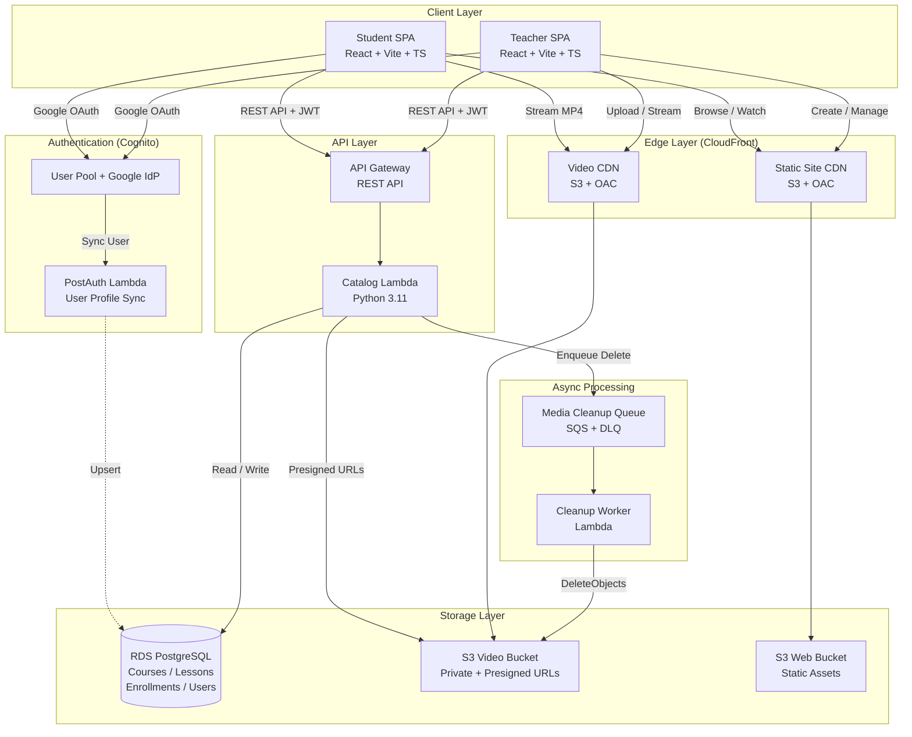

# StreamMyCourse

> A modern video course platform where instructors publish content and students learn anywhere.

[](https://github.com/Ahmed-Wesam/StreamMyCourse/actions/workflows/ci.yml)
[](./LICENSE.txt)
[](https://react.dev)
[](https://www.typescriptlang.org)
[](https://aws.amazon.com)

## What is StreamMyCourse?

StreamMyCourse is a serverless learning management system (LMS) built for video-first education. Instructors create courses, upload video lessons, and publish content for students to stream on any device.

### For Students

- **Browse courses** - Discover published courses in a clean catalog
- **Stream HD video** - Watch lessons with adaptive streaming via CloudFront CDN
- **One-click enrollment** - Sign in with Google and start learning immediately
- **Responsive design** - Works seamlessly on desktop, tablet, and mobile

### For Instructors

- **Course management** - Create courses with draft/publish workflow
- **Video uploads** - Direct browser-to-S3 uploads with presigned URLs
- **Lesson organization** - Arrange lessons with intuitive ordering
- **Student insights** - Track enrollments and course engagement

## Architecture



## Tech Stack

| Layer | Technology |
|-------|------------|
| **Frontend** | React 19, TypeScript, Vite, Tailwind CSS |
| **Authentication** | AWS Cognito with Google OAuth 2.0 |
| **Backend** | Python 3.11 Lambda, API Gateway |
| **Database** | PostgreSQL (RDS) - production catalog store |
| **Storage** | S3 for video content with CloudFront CDN |
| **Infrastructure** | CloudFormation (IaC), GitHub Actions CI/CD |
| **Testing** | Vitest (frontend), pytest (backend) |

## Quick Start

### Prerequisites

- [Node.js](https://nodejs.org/) 20+
- [Python](https://python.org/) 3.11+
- [AWS CLI](https://aws.amazon.com/cli/) v2 with configured credentials
- [GitHub CLI](https://cli.github.com/) (optional, for secret management)

### Installation

```bash
# Clone the repository
git clone https://github.com/Ahmed-Wesam/StreamMyCourse.git
cd StreamMyCourse

# Install frontend dependencies
cd frontend
npm ci

# Install Python test dependencies (for Lambda development)
pip install -r tests/unit/requirements.txt
```

### Local Development

```bash
# Start student site (port 5173)
npm run dev

# Start teacher site (port 5174)
npm run dev:teacher

# Run tests
npm run test                    # Frontend unit tests
python -m pytest tests/unit     # Lambda unit tests
```

### Environment Setup

Create `frontend/.env` from the example:

```bash
cp frontend/.env.example frontend/.env
```

Configure your API endpoint and Cognito settings (see [frontend/.env.example](frontend/.env.example) for details).

## Deployment

StreamMyCourse deploys to AWS using GitHub Actions with OIDC authentication. Infrastructure is managed via CloudFormation templates.

### Required GitHub Secrets/Variables

| Secret/Variable | Description |
|-----------------|-------------|
| `AWS_DEPLOY_ROLE_ARN` | OIDC role ARN for AWS deployment |
| `AWS_ACCOUNT_ID` | AWS account ID (set on both dev and prod environments) |
| `GOOGLE_OAUTH_CLIENT_ID` | Google OAuth client ID (for auth stack) |
| `GOOGLE_OAUTH_CLIENT_SECRET` | Google OAuth client secret (for auth stack) |

### Setting AWS Account ID

```bash
# Get your AWS account ID
aws sts get-caller-identity --query Account --output text

# Set as GitHub Actions variable (recommended - per environment)
gh variable set AWS_ACCOUNT_ID --env dev --body "YOUR_ACCOUNT_ID"
gh variable set AWS_ACCOUNT_ID --env prod --body "YOUR_ACCOUNT_ID"
```

See [infrastructure/README.md](infrastructure/README.md) for detailed deployment instructions.

## Documentation

- **[MVP Design & APIs](design.md)** - Architecture decisions, API contracts, and data model
- **[Roadmap](roadmap.md)** - Phase 2 vision: monetization, DRM, and scale
- **[Implementation History](ImplementationHistory.md)** - Engineering decisions and milestones
- **[Developer Guide](AGENTS.md)** - Contribution guidelines and CI/CD details
- **[Infrastructure Guide](infrastructure/README.md)** - AWS setup and deployment

## Project Structure

```
StreamMyCourse/
├── frontend/                    # Vite + React application
│   ├── src/
│   │   ├── student-app/        # Student SPA entry
│   │   ├── teacher-app/        # Teacher SPA entry
│   │   ├── components/         # Reusable UI components
│   │   ├── pages/              # Route-level screens
│   │   └── lib/                # API client, auth, utilities
│   └── package.json
├── infrastructure/
│   ├── lambda/catalog/         # Python Lambda API
│   │   └── services/           # Controller → Service → Repo layers
│   ├── templates/              # CloudFormation stacks
│   └── deploy.ps1              # Deployment script
├── scripts/                    # CI/CD and utility scripts
└── tests/
    ├── unit/                   # Lambda unit tests
    └── integration/            # Integration tests
```

## Security

This repository is proprietary software. For security concerns or vulnerability reports, please contact the maintainers directly.

See [LICENSE.txt](LICENSE.txt) for full terms.

## License

Proprietary and confidential — all rights reserved.  
Copyright (c) 2026 StreamMyCourse. All rights reserved.

---

*Built with modern web technologies on AWS serverless infrastructure.*
